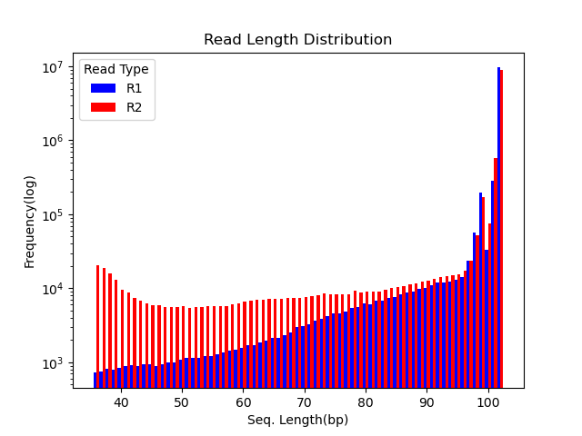
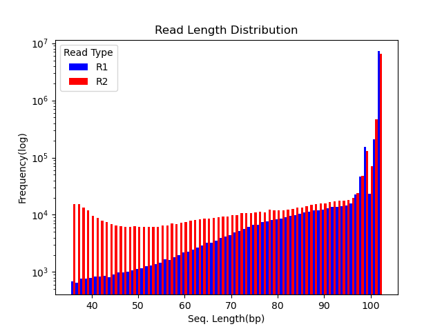

Kenneth Lai 
BI623: Assignment 2 


I will need to generate an R md file as a report later, but until we learn how to do that, I am including my notes for the report in here. I am emphasizing answers to questions of the github readme instructions. 

RMBR, each R1/R2 pair represents all transcripts detected for a given demultiplexed sample (they all belong to a specific example)

# Part 1 

### 2. Using FastQC via the command line on Talapas, produce plots of the per-base quality score distributions for R1 and R2 reads. Also, produce plots of the per-base N content, and comment on whether or not they are consistent with the quality score plots.

* For all 4 "Per Base Sequence Quality" plots, quality scores (for the most part) fell above 28 (in the green zone). As expected, the R2 plots for each showed slightly lower quality scores / position. For all 4 "Per base N content" plots, values were essentially 0 for all positions (except for extremely slight detection at the 1st position only, as expected). Considering a relationship where a high N content can heavily contribute to lower quality scores, I would say that these 2 plots (per each 4 files) are reflective of each other because low quality scores and 0 N scores are consistent with each other. 
* INCLUDE FASTQC PICTURES / EACH of 4 libraries --> per-base QS distribution & Per base N content 
    * need to unzip & copy desired pictures from zipped file in each libraries' fastqc directory (scp)

### 3. Run your quality score plotting script from your Demultiplexing assignment in Bi622. (Make sure you're using the "running sum" strategy!!) Describe how the FastQC quality score distribution plots compare to your own. If different, propose an explanation. Also, does the runtime differ? Mem/CPU usage? If so, why?
* INCLUDE PICTURES of OWN GRAPHS / LIBRARY [not fastqc]--> per-base QS distributions from own script (NOT FASTQC)
/home/kenlai/bgmp/bioinfo/Bi623/Assignments/Assignment2/QAA/
---> 1_2A_R1_qs_dist.png  1_2A_R2_qs_dist.png  6_2D_R1_qs_dist.png  6_2D_R2_qs_dist.png

* Compare Methods' Plots : 
    * The overall trend (numbers) of the QS plots were conserved / still captured between both plots 
    * However, FASTQC was better bc the formatting of their visualization enhances the features that we are concerned with when performing quality CTRL for per base quality 
        QUALITIES OF FASTQC THAT MAKE IT BETTER......
        * The bins / intervals of both x (position #) & y-axes (qs) had higher resolution / were smaller, allowing me to more easily pin point exact data point values 
        * Zones of suggested quality cutoffs / thresholds are color coded to help better identify sites of concerning quality (green, yellow, red)
        * whereas my plot was a bar chart, FASTQC provides a scatter plot w/ emphasis on error bars and trendlines. 
        * THUS...one could argue that I could add on more steps to my own script that tailor the graph to include details that match the high quality of FASTQC's. However, considering that FASTQC generates high quality plots while being FASTER (discussion below) & MORE EFFICIENT than my own scripts, I can see why people may want to use FASTQC instead of writing their own scripts, especially when time is of the essnece. 

* Comparing job stats: 
    * Table 1.3 
        * personal scripts (just to generate one of FASTQC's plots) took ~2-2.5 minutes depending on script. When timing FASTQC of the SAME INPUT file, runtime was ~74 seconds faster! 
        * FASTQC jobs used slightly less (%) of CPU. 

## Table 1.3 
| File name | label | Read length | JobID | Run Time(mm:ss) | CPU Usage (%)| Exit Status | Method Used | 
|---|---|---|---|---|---|---|---|
| 6_2D_mbnl_S5_L008_R1_001.fastq.gz | 6_2D_R1 | 101 | 15853756 | 2:35.65 | 95 | 0 |my own script|
| 6_2D_mbnl_S5_L008_R2_001.fastq.gz | 6_2D_R2 | 101 | 15853762 | 2:31.28 | 100 | 0 |my own script|
| 1_2A_control_S1_L008_R1_001.fastq.gz | 1_2A_R1 | 101 | 15853763 | 1:58.37 | 96 | 0 |my own script|
| 1_2A_control_S1_L008_R1_002.fastq.gz | 1_2A_R2 | 101 | 15853765 | 1:56.37| 99 | 0 |my own script|
| 1_2A_control_S1_L008_R1_002.fastq.gz | NA | 101 | 15883238 | 0:41.95 | 94 | 0 |FASTQC|

### 4. Comment on the overall data quality of your two libraries. Go beyond per-base qscore distributions. Make and justify a recommendation on whether these data are of high enough quality to use for further analysis.
- Overall Pretty Good.....
* Per-base QS Dist.: 
    * Per Seq. QS: BOTH libraries show majority of sequences fall on higher end of detected QS range in data. 
        * AS expected, R1 tends to have higher per-base QS > R2's(has error bars that dip into yellow, general values are lower). This is bc R2 is the last part of molec. to be seq.-ed. 
    * Total Sequences of R1&R2 match for both pairs 
    * Per base Sequence Content raise slight error due to inconsistant composition among the first 9-11 positions (among all libraries). However, stabilized after the 9th position. Contamination unlikeley as this not unusual, may be a result of adaptor contam. & primer-dimer formation (amplification creates artifacts from primer that show up as inconsistent low QS bases @ start of reads)
    * Seq. Duplication Lvls: 
        * for all 4 samples, ~10-13% of total sequences observed to have duplication levels at '>10'. Could be due to amplification bias? 
    * GC content ~50% for both samples(libraries) --> sign of  NO CONTAMINATION (humans genome tyically ~40-50%, sig. deviations from this value would have meant contam. )
    * all essentially have little to none N content in seq.s 
    * ALL LIBRARIES had little to no adaptor content in insert seq. In 1_2A libraries very little adaptor content detected around pos. 72-73 (end of seq.s). Overall, minimal adaptor trimming should be required post-FASTQC. 
    * ALL LIBRARIES EXCEPT 6_2D_R2 had 0 overrepresented sequences. 6_2D_R2 had 2 overrepresented seq.s were detected with no possible known sources. However these overrepresented sequences represented only ~0.17% & ~0.16% of the genome. Thus, contamination is unlikeley. 

Overall, I would say data quality of both libraries are good, indicating low chances of contamination. Majority of flagged results were not out of the usual (inconsistant base comp. @ start of sequences). Certain FASTQC results such as the presence of overrepresented seq.s in one of the R2 libraries may require deeper invesitigation. However, this data all seems high quality and trustable enough for downstream analysis. 

# Part 2
### 6. MY METHOD 
#### "Sanity check: Use your Unix skills to search for the adapter sequences in your datasets and confirm the expected sequence orientations. Report the commands you used, the reasoning behind them, and how you confirmed the adapter sequences."
* I wrote cutadapt.sh so that it would output 4 lines from the following code: 
    * Confirming Orientation: We should expect 0 for the 1st line (undesired adaptor count) bc this is the adaptor of the other orientation. If it is 0, we can confirm that our library is the orientation that we expect it to be (R1 vs. R2)
    * Confirm Adaptor Sequences: to make sure that the adaptor seq. of the expected orientation was in the library's seq.s, I counted the occurance of said adaptor seq. in each seq. line of the file. This number should be higher than 0. 
    * Confirm that cutadapt worked: we should see that the last line should drop to 0, proving that the adapter sequences have been cutout of the fastq file. This code counts occurances of adaptor seq. in new file.  
* to count occurances of barcodes I used (in .sh script): ```zcat /projects/bgmp/shared/2017_sequencing/demultiplexed/6_2D_mbnl_S5_L008_R1_001.fastq.gz | awk 'NR%4==2' | grep -c 'AGATCGGAAGAGCACACGTCTGAACTCCAGTCA'```
```
echo "Undesired Adaptor count: $unwanted_count"
echo "Adaptor count BEFORE cutadapt: $pre_count"
echo "Adaptor count AFTER cutadapt: $post_count"
```
JOB TRACKER / STATS/ SANITY CHECK DATA: 
| Sample | JobID | Run Time(mm:ss) | CPU Usage (%)| Exit Status | Undesired Adaptor count | Correct Orient. | Adaptor count BEFORE cutadapt | Adaptor count AFTER cutadapt | Adaptors Removed Succesfully | 
|---|---|---|---|---|---|---|---|---|---|
|6_2D_R1|15884094|1:18.50|98|0|0|T|12870|0|T| 
|6_2D_R2|15884128|1:22.11|99|0|0|T|15377|0|T|
|1_2A_R1|15884130|1:01.32|99|0|0|T|31837|0|T|
|1_2A_R2|15884131|1:06.32|97|0|0|T|32536|0|T|

### 8. 
"Plot the trimmed read length distributions for both R1 and R2 reads (on the same plot - yes, you will have to use Python or R to plot this. See ICA4 from Bi621). You can produce 2 different plots for your 2 different RNA-seq samples. There are a number of ways you could possibly do this. One useful thing your plot should show, for example, is whether R1s are trimmed more extensively than R2s, or vice versa. Comment on whether you expect R1s and R2s to be adapter-trimmed at different rates and why." 

* Inital Hypothesis/Comment: I expect R2 to be adaptor-trimmed at a higher rate. Since R2 is the last portion of the molecule to be sequenced, it experiences degradation for longer periods of time. Thus, the quality of these reads tend to be lower than that of R1. Considering the increased likeleyhood in low-quality bases in R2, more extensive trimming of R2 would not be unexpected if observed. 

PLOTS: 
* generated w/ read_len_dist_plot.py
    * For this analysis I only included reads that were still considered paired (post-trimmomatic/quality-trimming)

|Library 6_2D|Library 1_2A|
|---|---|
| ||

* For both libraries, THE SAME patterns were observed regarding their read length distributions post-quality-trimming via trimmomatic (meeting my initial hypothesis):

```
For the longest read lengths, R1 shows a higher frequency compared to R2. Conversely, for shorter lengths, R2 tends to exceed R1's frequency. This pattern aligns with expectations that R2 experiences higher trimming rates due to its inherent lower quality (a result of increased exposure to degradation during sequencing). Higher trimming would reduce the number of longer reads and potentially increase the frequency of shorter reads in R2 compared to R1.
```

# Part 3
### METHOD 
* The PAIRED quality-trimmed ( & adaptor-trimmed) R1 & R2 transcript read files from Part 2 were aligned to the ref. mouse genome from ensemble [release 112] (Mus_musculus.GRCm39.dna.ens112.STAR_2.7.11b) using STAR v. 2.7.11b. 

### 12. MAPPED vs. UNMAPPED READ COUNTS 
* Mapped vs. Unmapped read counts were determiend per library 

MAPPED vs. UNMAPPED COUNT RESULTS: 
| Library | Mapped Reads Count | Unmapped Reads Count |
|---|---|---|
|6_2D|20127382|795232|
|1_2A|15530231|402461|


### 14. Determining if Library is Strand-specific. 
METHOD:
I am going to write a .sh script (with commands from Part 2 of https://github.com/2024-BGMP/ica4-klai22/blob/master/ICA4.md) that calc.s % of reads mapped to a feature for the reverse vs. yes (strandedness) gene count tables. I will then compare these %s for each library. If there is a higher % in the table from strandednes=yes, I will assume it is strand-specific library. If there is a higher % in the table for strandedness = no instead, I will assume it is NOT strand-specific[reverse ]. 

* https://htseq.readthedocs.io/en/release_0.11.1/count.html
"Important: The default for strandedness is yes. If your RNA-Seq data has not been made with a strand-specific protocol, this causes half of the reads to be lost. Hence, make sure to set the option --stranded=no unless you have strand-specific data!"
"For stranded=no, a read is considered overlapping with a feature regardless of whether it is mapped to the same or the opposite strand as the feature. For stranded=yes and single-end reads, the read has to be mapped to the same strand as the feature. For paired-end reads, the first read has to be on the same strand and the second read on the opposite strand. For stranded=reverse, these rules are reversed."

RESULTS: 
| Sample | Strand-Specificity (parameter used for htseq-count to gen. input table) | JobID | Output | % of mapped features|
|---|---|---|---|---|
|6_2D_yes|yes|15903612|% of mapped features for 6_2D_yes: 3|3|
|6_2D_rev|reversed|15903624|% of mapped features for 6_2D_rev: 82|82|
|6_2D_no|none|15903625|% of mapped features for 6_2D_no: 79|79|
|1_2A_yes|yes|15903626|% of mapped features for 1_2A_yes: 3|3|
|1_2A_rev|reversed|15903627|% of mapped features for 1_2A_rev: 85|85|
|1_2A_no|none|15903629|% of mapped features for 1_2A_no: 83|83|

ANSWER v.1
```
The gene count tables yielded the highest % of mapped features when the "--stranded=reverse" parameter was applied to "htseq-count" (compared to those resulting from "--stranded=yes" & "--stranded=no" specifications ). This result was true for both of my assigned lirbaries (6_2D & 1_2A). This not only suggests that these data are strand-specific, but also that the correction orientation is 'reverse'. In other words, reads were likely sequenced in the reverse direction relative to the original RNA strand. This infers that during sequencing, when RNA was converted to cDNA, reads were synthesized from the strand complementary to the original RNA strand. 
```
ANSWER v.2
```
The RNA-seq data I was assigned likeley represent strand-specific libraries (6_2D & 1_2A). In both cases, applying the '--stranded=reverse' parameter to HTseq-count yielded the highest percentage of mapped features compared to other settings ('--stranded=yes' & especially'--stranded-no'). Thus, the strandedness of this data is of the 'reverse' orientation, inferring that reads aligned to the strand which complemented the original RNA strand. 

For 6_2D, 82% of reads mapped to features when htseq-count's --stranded parameter was =  reverse. 
For 1_2A, 85% of reads mapped to features when htseq-count's --stranded parameter was =  reverse. 

Other percentages of mapped reads yielded from different parameters can be found in Table_____(above). 
```


FILES THAT NEED TO BE DOWNLOADED for report 
* the zipped files that include all fastqc plots (need the per-base qs -dist. & per-base N content plots for each library's R1 & R2)...each located in..
    * 1_2A_R1fastqc/
    * 1_2A_R2fastqc/
    * 6_2D_R1fastqc/
    * 6_2D_R2fastqc/

* Post-quality-trimming read length distributions per library 
    * 6_2D_read_len_dist.png
    * 1_2A_read_len_dist.png 